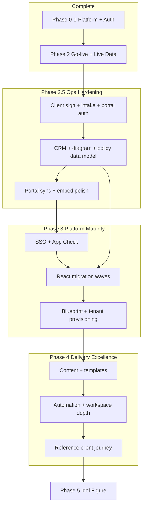

# Kolthoff OS — Tech Stack Migration Roadmap

Holistic plan to finish the platform migration so you can focus on **content, client delivery, and operational excellence** — not infrastructure.

**Live today:** [kolthoff-consulting.com](https://kolthoff-consulting.com) on Firebase (`kolthoff-portal`) with production data.

---

## Vision

Kolthoff OS is the **reference operating system** for how you deliver MOD 1–4 engagements: one hub where SOWs, CRM, client portals, workspace collaboration, and analytics connect. When migration is complete:

- Staff sign in once and run the full delivery lifecycle.
- Clients sign contracts, complete intake, and track progress in a branded portal.
- Workspace modules reflect what you sold in the planner — not duplicate manual work.
- The stack is secure, testable, and maintainable — an **idol figure** you can show clients as proof of operational excellence.

---

## Architecture today

```
┌─────────────────────────────────────────────────────────────────────────┐
│  FIREBASE (kolthoff-portal)                                             │
│  Hosting │ Firestore │ Auth │ Storage │ Functions (asia-southeast1)     │
└─────────────────────────────────────────────────────────────────────────┘
                                    │
        ┌───────────────────────────┼───────────────────────────┐
        ▼                           ▼                           ▼
┌───────────────┐           ┌───────────────┐           ┌───────────────┐
│  COMMAND      │           │  DELIVERY     │           │  CLIENT       │
│  /admin/      │           │  Planner      │           │  Portal       │
│  React SPA    │           │  Diagnosis    │           │  Intake       │
│  Dashboard    │           │  Policy/WF    │           │  Contract Sign│
│  Tenants      │           │  CRM          │           │  Marketing /  │
│  Intake       │           │  Analytics×3  │           │               │
│  Portals      │           │               │           │               │
│  Contracts    │           │  (HTML+CDN)   │           │  (HTML+CDN)   │
│  Master Admin │           │               │           │               │
└───────────────┘           └───────────────┘           └───────────────┘
        │                           │                           │
        └───────────────────────────┼───────────────────────────┘
                                    ▼
                          ┌───────────────┐
                          │  WORKSPACE    │
                          │  /workspace/  │
                          │  React SPA    │
                          │  Messenger    │
                          │  Approvals    │
                          │  Vault / CRM  │
                          └───────────────┘

Data path: artifacts/{tenantId}/public/data/{collection}/{docId}
Default tenant: kolthoff-admin-app
Shared: `firebase-init`, `auth-gate`, `financials`, `engagement-config`, `portal-sync`, `workflow-tabs`, `crm-share`
Content model: **`docs/content-model.md`** — `workbook_profiles` as single engagement hub
```

### App inventory

| Layer | App | Tech | Maturity |
|-------|-----|------|----------|
| Command | Admin console | React (Vite) | **Production** — sidebar, embeds, quick actions |
| Command | Tenant Manager | React | **Production** — flags, invites, password reset |
| Command | Intake Center | React | **Production** — templates, auto-merge + portal sync |
| Command | Portal Manager | React | **Production** — SOW import, sync-from-profile |
| Command | Contract Ledger | React | **Production** — client sign links |
| Command | Master Admin | React | **Basic** — tickets OK; blueprints list-only |
| Delivery | Project Planner | HTML/React CDN | **Production** — engagement hub writer |
| Delivery | Diagnosis Reports | HTML/React CDN | **Production** — merged workflow tabs |
| Operations | CRM Pipeline | HTML/React CDN | **Production** — canonical CRM + share links |
| Operations | Policy Studio | HTML/React CDN | **Production** — portal auto-sync on save |
| Operations | Workflow Builder | HTML/React CDN | **Production** — slice-based tab persistence |
| Analytics | Firm / Capacity / Time | HTML/React CDN | **Functional** — manual data entry |
| Workspace | Core Workspace | React (Vite) | **MVP** — modules partially built |
| Client | Portal | HTML/React CDN | **Functional** — portal token auth still TODO |
| Client | Intake form | HTML/React CDN | **Functional** — verify submit on production |
| Client | Contract sign | HTML/React CDN | **Production** — scoped Firestore rules |
| Public | Marketing site | Static HTML | **Production** |

### Cloud Functions

| Function | Purpose | Wired in UI |
|----------|---------|-------------|
| `inviteWorkspaceUser` | Auth user + `core_users` | ✅ Tenant Manager |
| `generatePortalToken` | Client scoped custom token | ❌ Not used |
| `verifyAdminPasscode` | Callable passcode (legacy) | Partial — Firestore path preferred |
| `onWorkbookProfileWritten` | Validate/cache profile metadata | ✅ Trigger |

---

## Phase summary

| Phase | Name | Status | Your focus |
|-------|------|--------|------------|
| **0–1** | Platform migration + auth | ✅ **Complete** | — |
| **2** | Go-live + live data + DNS | ✅ **Complete** | Content in planner/CRM/portals |
| **2.5** | Ops hardening (remaining gaps) | 🔶 **In progress** — much landed on `main` | Light — test client journeys |
| **3** | Platform maturity (security + unified UI) | ⏳ Planned | Minimal |
| **4** | Delivery excellence (content + automation) | ⏳ After 2.5/3 | **Primary focus** |
| **5** | Idol figure (benchmark OS) | ⏳ Ongoing | Case studies, templates, metrics |

**Definition of “migration complete”:** Phases **2.5 + 3** done. Phase **4** is where you live as a consultancy.

---

## ✅ Phases 0–2 — Complete

### Phase 0 — Unified Firebase platform
- Monorepo: `apps/`, `admin/`, `workspace/`, `shared/`, `functions/`
- Firebase Hosting, Firestore rules, Storage rules, CI/CD on `main`
- Legacy URL redirects (`/crm_pipeline.html` → ops CRM, etc.)

### Phase 1 — Auth & single login
- Admin passcode → `admin_credentials` + `admin_sessions`
- `shared/auth-gate.js` on all internal HTML apps
- Admin legacy HTML removed → React SPA routes
- API key HTTP referrers; Anonymous + Email/Password auth

### Phase 2 — Go-live
- Custom domain `kolthoff-consulting.com` on Firebase
- GitHub Pages retired
- Seed tooling: `go-live-cloudshell.sh`, `seed-production-data.sh`
- Live production data in Firestore
- Smoke tests: 18/18 on apex + www domains

### Recent engineering (post go-live — already on `main`)

These were Phase 2.5 goals that have **landed**; verify on production, then treat as done:

| Area | What shipped |
|------|----------------|
| **Content hub** | `workbook_profiles` schema v2, `engagement-config`, `docs/content-model.md` |
| **Contract e-sign** | Scoped Firestore rules; expanded `contract_sign.html` |
| **Workflow tabs** | `diagnosisWorkflow` / `workflowBuilder` slices via `shared/workflow-tabs.js` |
| **Portal sync** | `portal-sync.js` + admin lib — auto-sync on planner/diagnosis/policy save |
| **Intake merge** | `intake-merge.ts` — mapped targets, auto portal push |
| **CRM links** | `links.crmDealId`, share links, public CRM view |
| **Tenant / workspace** | Expanded Tenants, password reset, member workflow |
| **Admin UX** | Quick actions, nav customize, embed auth, sidebar DnD |
| **Tests** | Rules, portal-sync, workflow-tabs, intake-merge, engagement-config |

---

## 🔶 Phase 2.5 — Remaining ops hardening

**Goal:** Close the last gaps so every workflow is reliable before SSO and full React migration.

### 2.5A — Still open (client & security)

| # | Deliverable | Status | Outcome |
|---|-------------|--------|---------|
| 2.5.1 | **Portal custom-token auth** | ❌ Open | Wire `generatePortalToken`; `portal_client` rules — replace anonymous portal reads |
| 2.5.2 | **Intake submit on production** | ⚠️ Verify | Confirm client form submit works end-to-end on custom domain |
| 2.5.3 | **Client error UX** | ⚠️ Partial | Replace remaining `alert()` with inline errors on portal/intake |

### 2.5B — Still open (data & workspace)

| # | Deliverable | Status | Outcome |
|---|-------------|--------|---------|
| 2.5.4 | **Workspace CRM schema** | ❌ Open | Align with ops CRM or keep CRM flag off in workspace |
| 2.5.5 | **Policy Studio → Vault** | ❌ Open | Publish `policy_documents` → `core_policies` for workspace Vault |
| 2.5.6 | **Staff identity in workspace** | ❌ Open | Map admin session to real `core_users` (not hardcoded staff email) |
| 2.5.7 | **CRM won/lost → planner** | ⚠️ Partial | Bidirectional status when deal closes |

### 2.5C — Polish & Phase 3 prep

| # | Deliverable | Status |
|---|-------------|--------|
| 2.5.8 | Embed mode — hide duplicate headers in all HTML apps | ⚠️ Partial |
| 2.5.9 | `initAppCheck()` in all HTML bootstraps | Small |
| 2.5.10 | Centralize Firebase config (single source) | Small |
| 2.5.11 | Analytics: planner-driven capacity/time baselines | Medium |

### Phase 2.5 exit criteria (updated)

- [x] Client contract sign (rules + UI)
- [x] No tab clobber between Diagnosis and Workflow Builder
- [x] Portal sync from planner/intake (auto)
- [x] CRM ↔ planner financial sync + explicit links
- [ ] Portal custom-token auth live
- [ ] Policy → Vault publish path
- [ ] Workspace CRM aligned or disabled
- [ ] Full client journey verified on `kolthoff-consulting.com`

---

## ⏳ Phase 3 — Platform Maturity

**Goal:** Enterprise-grade identity, abuse protection, and a **single React shell** — retire iframe + CDN HTML maintenance.

### 3A — Security & identity

| Deliverable | Description |
|-------------|-------------|
| Google Workspace SSO | `@kolthoff-consulting.com` sign-in for admin + workspace; passcode as break-glass |
| App Check + reCAPTCHA v3 | Enforce on all apps; configure `RECAPTCHA_SITE_KEY` |
| Firestore rules hardening | Tighten after App Check + custom claims proven |
| Secret hygiene | Redact API key in docs; dismiss GitHub secret scanning as public client key |

### 3B — React consolidation (migration order)

| Wave | Apps | Rationale |
|------|------|-----------|
| **3B-1** | Project Planner, Diagnosis Reports | Highest daily use; already embedded in admin |
| **3B-2** | CRM, Policy Studio, Workflow Builder | Operations core |
| **3B-3** | Analytics suite (×3) | Planner-driven data after 2.5.11 |
| **3B-4** | Portal, Intake, Contract Sign | After 2.5A client auth stable |
| **3B-5** | Marketing site | Optional — static is fine |

**Per-app standard:** React route under `/admin/app/...` or shared Vite package; shared Firebase hooks; feature parity; delete HTML duplicate.

### 3C — Master Admin & multi-tenant

| Deliverable | Description |
|-------------|-------------|
| Blueprint designer | Create/edit `master_templates` (fields, flowSteps) — visual designer can follow |
| Client workspace provisioning | Admin wizard: new client → tenant ID + seed + portal + invite |
| SOW → portal pipeline | One-click: planner profile → portal + access code + contract doc |

### Phase 3 exit criteria

- [ ] Staff SSO on admin + workspace
- [ ] App Check enforced in production
- [ ] Delivery + operations apps run natively in admin (no iframes)
- [ ] Portal uses custom tokens only (anonymous portal access removed)
- [ ] New client onboarded via admin without manual Firestore edits

---

## ⏳ Phase 4 — Delivery Excellence (your primary focus)

**Goal:** Enrich the OS with **content, playbooks, and automation** so every client engagement runs the same excellence playbook. This is where Kolthoff becomes the **idol figure**.

### 4A — Content & templates (you own this)

| Area | What to build |
|------|----------------|
| SOW library | Standard MOD 1–4 profiles in `workbook_profiles`; industry variants |
| CRM playbooks | Deal stages, follow-up templates, partner referral flows |
| Intake templates | Pre-built forms per module with mapped planner fields |
| Portal defaults | Roadmap milestones, action items, asset categories per phase |
| Policy packs | DOLE-shielded handbook templates in Policy Studio |
| Blueprint library | Approval flows for common client requests |

### 4B — Tool optimization (light eng support)

| Area | Enhancement |
|------|-------------|
| Planner | Faster SOW cloning, CRM import, print/PDF polish |
| CRM | Pipeline analytics, follow-up reminders, deal aging |
| Analytics | Auto-populate from planner tasks (hours, capacity) |
| Portal | Client upload inbox for staff review; Drive link automation docs |
| Workspace | Full Approvals workflow (approve/reject); Messenger threads |
| Master Admin | IT ticket SLA views; blueprint deploy to tenant |

### 4C — Client delivery automation

| Flow | Automation target |
|------|-------------------|
| Signed SOW | → Create portal + workspace tenant + intake form |
| MOD 1 complete | → Update portal phase + unlock MOD 2 intake |
| Policy published | → Notify client in portal action items |
| Contract signed | → Audit log + CRM stage → Won |

### Phase 4 exit criteria

- [ ] Repeatable "new client" runbook executed without custom Firestore edits
- [ ] Template library covers 80% of engagements
- [ ] Portal reflects live delivery status without manual Portal Manager updates
- [ ] Case study: one full client journey documented as the **reference engagement**

---

## ⏳ Phase 5 — Idol Figure (continuous)

**Goal:** Kolthoff OS is demonstrable proof of operational excellence — for prospects, partners, and your team.

| Initiative | Description |
|------------|-------------|
| Demo tenant | Sandbox with anonymized sample data for sales |
| Metrics dashboard | Firm-wide: active SOWs, portal engagement, SLA compliance |
| Documentation | Client-facing "how we deliver" tied to portal views |
| White-label readiness | Optional per-client branding on portal (future) |
| Integrations | Google Drive API, Calendar, Lark (as clients require) |
| Compliance | App Check audit, access reviews, backup/restore runbooks |

---

## Dependency map



---

## What you can focus on when

| Your time | During | After |
|-----------|--------|-------|
| **Content** (SOWs, policies, portal copy, intake questions) | Now — always | Phase 4 primary |
| **Client delivery** (live engagements, portal updates) | Now | Always |
| **Testing client journeys** | Phase 2.5 | Sign, intake, portal on production |
| **Feature ideas for tools** | Phase 4 backlog | Prioritize by MOD delivery impact |
| **Infrastructure / SSO / migration** | Phase 2.5–3 | Delegate to eng; then ignore |

**Rule of thumb:** If it touches **Firestore rules, auth, or React architecture** → Phase 2.5/3 (engineering). If it touches **what the client sees or how you deliver** → Phase 4 (you).

---

## Remaining engineering backlog (consolidated)

### Must do (Phase 2.5 — remaining)
1. Portal custom-token auth (`generatePortalToken` + rules)
2. Policy Studio → Vault publish
3. Workspace CRM alignment (or keep disabled)
4. Staff → `core_users` identity in workspace
5. Verify intake submit + full client journey on production domain

### Should do (Phase 3)
8. Google Workspace SSO
9. App Check enforcement
10. React migration (delivery → ops → analytics → client)
11. Master Admin blueprint CRUD
12. Client workspace provisioning wizard

### Can wait (Phase 4–5)
13. Full workspace module depth (Messenger, Approvals workflows)
14. Analytics auto-seed from planner
15. Google Drive API integration
16. Marketing site CMS
17. White-label portal branding

---

## Success metrics

| Metric | Target when migration complete |
|--------|-------------------------------|
| Client contract sign completion rate | >95% without staff intervention |
| Intake form completion → planner sync | Automatic within 1 minute |
| Portal progress accuracy | Matches planner module state without manual edit |
| Staff apps in React / admin shell | 100% of delivery + ops |
| Time to provision new client tenant | <15 minutes via admin |
| Smoke tests | 18/18 on custom domain in CI |
| Zero critical Firestore rule gaps for client flows | Rules test coverage |

---

## Related docs

| Doc | Purpose |
|-----|---------|
| `docs/project-completion.md` | Go-live checklist (Phases 1–2) |
| `docs/data-model.md` | Firestore collections |
| `docs/content-model.md` | Engagement hub (`workbook_profiles`) schema |
| `docs/data-seeding.md` | Production data load |
| `docs/security-access.md` | Public vs staff apps |
| `docs/dns-cutover.md` | DNS (complete) |
| `docs/admin-login.md` | Passcode troubleshooting |

---

*Last updated: June 2026 — go-live complete; Phase 2.5 partially shipped on `main`*
