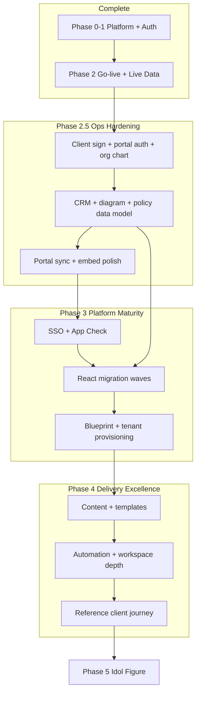

# Kolthoff OS — Platform Roadmap

Holistic plan to reach a **stable, fast, and optimized** operating system that supports **Kolthoff consulting delivery (MOD 1–4)** and **product sales (PRO 1 Agency Ops, PRO 2 planned)** — so the team focuses on clients and content, not infrastructure.

**Live today:** [kolthoff-consulting.com](https://kolthoff-consulting.com) and [kolthoff-portal.web.app](https://kolthoff-portal.web.app) on Firebase (`kolthoff-portal`) with production data.

---

## North star — “done” looks like

| Dimension | Target |
|-----------|--------|
| **Stable** | Staff and clients complete core flows without 404s, auth loops, silent deploy failures, or iframe breakage. CI deploys green; break-glass passcode always works. |
| **Fast** | Admin + workspace load in &lt;3s on warm cache; Google SSO completes without popup/COOP hangs; Functions cold-start provisioning does not block login. |
| **Optimized** | One admin shell, minimal duplicate chrome, immutable asset caching, no 800KB+ un-split bundles long-term. |
| **Full function — Consulting** | CRM → Planner → Contract → Portal → Org Chart → Collections for MOD engagements; workspace modules usable when sold. |
| **Full function — Products** | PRO 1 lead-to-cash: CRM product deal → Planner package → Sign → Auto-provision Agency Ops → Subscription billing in Collections. |

**Definition of platform complete:** P4 verified on production + P5 App Check enforced + P6 React migration for daily apps + PRO auto-provision reliable + Kolthoff MOD onboarding wizard (P7).

---

## Current status (6 July 2026)

**You are here:** Core platform is **live and stable on `main`**. **Platform engineering for Phases 2.5 + 3A/P7 is complete** (#198–#210): Agency Ops PRO 1, Core Workspace pilot, unified onboard tabs, CI deploy fixes, nav cleanup. Automated smoke: **26/26** on `kolthoff-consulting.com`. **Showstopper:** P4 manual sign-off only — run `docs/p4-verification.md` sections A–D (~45 min), then Phase 4 content.

### PRO 1 · Agency Ops — plan closed (engineering)

| Deliverable | Status |
|-------------|--------|
| Product catalog + engagement packages + PRO PDF labels | ✅ |
| Auto-provision on contract sign + CRM Won | ✅ |
| Agency Ops Manager (provision, retry, search, handoff, passcode reset, cancel/delete) | ✅ |
| Client UX (passcode embeds, `?tenant=`, branding, empty planner) | ✅ |
| PRO Subscriptions billing in Collections | ✅ |
| Single sidebar entry: **Agency Ops Manager** | ✅ |
| Production smoke routes | ✅ 26/26 on `kolthoff-consulting.com` |

**Not engineering:** P4 sign-off (sections B1–B7), first paying client handoff, Phase 4 content (SOW library, CRM playbooks).

| Lane | Status | What it means |
|------|--------|---------------|
| **Platform shell** | ✅ **Stable on `main`** | Admin, workspace, hosting rewrites, CI deploys, Google redirect SSO |
| **Admin embeds** | ✅ **Fixed** | Core Workspace + analytics sidebars visible in iframe (#173, #166); stale asset rewrites (#145) |
| **Agency Ops PRO** | ✅ **Production-ready (eng)** | Auto + manual provision, Manager (search, SOW links, active tenant, passcode reset, cancel/delete), client UX (#186–#189), staff UX (#196, #201); single sidebar entry **Agency Ops Manager** (#203–#204) |
| **Core Workspace** | ✅ **Pilot-ready (eng)** | Approvals/Messenger v1, onboarding wizard `/admin/onboard`, MOD auto-provision on sign (#198, #202); Functions deploy fix (#205), hosting rewrite (#206) |
| **Staff SSO** | ✅ **Improved** | Firestore-only staff provisioning path; cold-start timeout handling (#175–176) |
| **Admin UX** | ✅ **Updated** | Sidebar defaults: Command → Project Management → Deliverables → Product → Analytics → Client (#170); Customize → Done saves org default to Firestore |
| **P4 Verification** | ⏳ **Your turn** | End-to-end on `kolthoff-consulting.com` (~45 min) — `docs/p4-verification.md` sections **A + B + C + D** |
| **P5 App Check** | ⏳ **Recommended** | Bootstrap in code; enforcement not yet required in Console |
| **P6 React migration** | ⏳ **Next eng** | Retire HTML iframe apps → native admin routes (planner first) |
| **P7 MOD onboarding** | ✅ **Embedded in admin** | Workspace Admin + Agency Ops Manager **Onboard** tabs; `/admin/onboard` redirects |

### Your checklist (priority order)

1. ~~**Deploy hosting**~~ — CI deploys on merge to `main`; latest deploy verified (smoke **24/24**). Hard-refresh if assets look stale.
2. **P4 smoke test (consulting)** — Contract sign → portal login → org chart in portal → file upload. **Runbook:** `docs/p4-verification.md` section **A**.
3. **P4 smoke test (PRO 1 / Agency Ops)** — Client passcode → blank planner → sign → tenant ready → Collections PRO invoices. **Runbook:** section **B**.
4. **P4 smoke test (Core Workspace pilot)** — Onboard wizard → Approvals flow → Messenger badges. **Runbook:** section **D**.
5. **P4 embed sanity** — Resource Capacity + Project Planner in admin iframe. **Runbook:** section **C** (~2 min).
6. **App Check (optional, recommended)** — reCAPTCHA v3 key → GitHub secret `RECAPTCHA_SITE_KEY` → redeploy → monitor → enforce Firestore last. See `docs/app-check-sso.md`.
7. **Content & templates (Phase 4)** — SOW library, CRM playbooks, portal defaults — **primary focus once P4 passes**.
8. **Stop worrying about infra** unless something breaks — engineering owns P6 and performance backlog.

### Engineering owns (unless P4 finds gaps)

- React migration waves (P6): planner → CRM/ops → analytics → client apps
- Bundle/code-split admin + workspace SPAs (&lt;500KB chunks)
- Planner retainer buffer vs signed PDF alignment (e.g. KC-2026-003 Care Plan)
- Workspace module depth — Approvals v1 + Messenger v1 shipped (#198, #202); deeper Lark parity deferred
- Master Admin blueprint designer (P7 visual editor — wizard shipped at `/admin/onboard`)
- Monitoring: deploy health checks, Function error alerts, Firestore rules regression in CI

---

## Two business lanes (same platform)

### Lane A — Kolthoff consulting (MOD 1–4 services)

| Flow | Apps involved | Status |
|------|---------------|--------|
| Sell | CRM Pipeline, Project Planner | ✅ Production |
| Contract | Contract Ledger, `contract_sign.html` | ✅ Production |
| Deliver | Org Chart, Diagnosis, Policy, Workflow | ✅ Production (HTML embeds) |
| Client view | Portal, org chart sync | ✅ Production — **verify P4** |
| Bill | Collections (milestones + care plan) | ✅ Production |
| Collaborate | Core Workspace (Messenger, Approvals, Vault, CRM) | ✅ Approvals v1 + Messenger v1 + onboarding wizard on `main` — **pilot verify section D** |

### Lane B — PRO products (subscription software)

| SKU | Lead-to-cash | Status |
|-----|--------------|--------|
| **PRO 1 · Agency Ops** | CRM → Planner package → Sign → auto-provision → Manager handoff → client passcode at `/agency-ops/?tenant=` → Collections PRO tab | ✅ **Eng complete** — **verify P4 B1–B7** |
| **PRO 2 · Core Workspace** | CRM → Sign → auto-provision Core Workspace → client portal + Approvals/Messenger | ✅ Auto-provision on contract sign (MOD + PRO 2 profiles) — **pilot verify section D** |

See `docs/product-pro-catalog.md` and `docs/agency-ops-starter.md`.

---

## Three engineering pillars (remaining work)

### Pillar 1 — Stability & reliability

**Goal:** Nothing critical breaks silently; every deploy ships complete `dist/`.

| # | Item | Status | Notes |
|---|------|--------|-------|
| S1 | Workspace builds in CI | ✅ | `ensureAuthReady` export + build script fail-fast (#146) |
| S2 | Admin SPA asset rewrites | ✅ | JS/CSS not served as HTML (#145) |
| S3 | Google SSO redirect-first | ✅ | No COOP popup hang (#141) |
| S4 | Workspace + analytics embed sidebars | ✅ | #173, #166 |
| S5 | Agency Ops provision (no public CORS) | ✅ | Firestore trigger `processAgencyOpsProvisionRequest` (#165) |
| S6 | Functions deploy type conflicts | ✅ | CI deletes orphaned HTTPS functions (#168) |
| S7 | Staff SSO cold-start timeout | ✅ | Firestore-only provision path (#175–176) |
| S8 | **P4 production verification** | ⏳ | You — consulting + PRO paths |
| S9 | App Check enforcement | ⏳ | After monitoring period |
| S10 | Error monitoring / alerts | ⏳ | Firebase Console alerts on Function failures |

### Pillar 2 — Speed & performance

**Goal:** Staff perceive the admin as snappy; first login acceptable; embeds load without layout thrash.

| # | Item | Status | Notes |
|---|------|--------|-------|
| F1 | Immutable hashed assets (`/admin/assets/**`, `/workspace/assets/**`) | ✅ | Long cache in `firebase.json` |
| F2 | HTML no-cache on SPAs | ✅ | Prevents stale index referencing old chunks |
| F3 | Admin embed cache-bust param (`?v=`) | ✅ | Bump in `EmbedApp.tsx` when HTML apps change |
| F4 | Sidebar auto-fit (no overflow scroll) | ✅ | `useSidebarFit` hook |
| F5 | **Code-split admin bundle** | ⏳ | Main chunk ~900KB — split planner/admin routes |
| F6 | **Code-split workspace bundle** | ⏳ | Main chunk ~765KB |
| F7 | **Migrate HTML apps to React** | ⏳ | Removes double load (admin + iframe CDN React) |
| F8 | Functions min instances (optional) | ⏳ | If cold-start still hurts provision/login |

### Pillar 3 — Function completeness

**Goal:** Every sold capability works end-to-end without manual Firestore edits.

| Area | Must work | Gap |
|------|-----------|-----|
| **Consulting sell→cash** | CRM, Planner, Contract, Collections | Planner buffer vs signed quote; P4 verify |
| **Client experience** | Portal token auth, org chart, uploads | P4 verify on custom domain |
| **Delivery tools** | Diagnosis, Policy→Vault, Workflow tabs | HTML embeds — migrate in P6 |
| **Analytics** | Firm, Capacity, Time | Manual entry; planner baselines exist |
| **Workspace** | SSO embed, module nav | Approvals/Messenger depth |
| **PRO 1 Agency Ops** | Auto-provision on sign, client passcode, empty planner, billing rhythm | ✅ **Eng complete** — **P4 verify B1–B7** |
| **PRO 2 Workspace** | Auto-provision on sign, Approvals/Messenger v1, onboard wizard | ✅ Pilot path on `main` — **P4 section D**; product sale **on hold** |
| **Kolthoff onboarding** | New MOD client wizard | ✅ `/admin/onboard` shipped (#202) |

---

## Vision

Kolthoff OS is the **reference operating system** for how you deliver MOD 1–4 engagements: one hub where SOWs, CRM, client portals, workspace collaboration, and analytics connect. When migration is complete:

- Staff sign in once and run the full delivery lifecycle.
- Clients sign contracts, view org structure, and track progress in a branded portal.
- Workspace modules reflect what you sold in the planner — not duplicate manual work.
- The stack is secure, testable, and maintainable — an **idol figure** you can show clients as proof of operational excellence.

---

## Architecture today

```
┌─────────────────────────────────────────────────────────────────────────┐
│  FIREBASE (kolthoff-portal)                                             │
│  Hosting │ Firestore │ Auth │ Storage │ Functions (asia-southeast1)     │
└─────────────────────────────────────────────────────────────────────────┘
                                    │
        ┌───────────────────────────┼───────────────────────────┐
        ▼                           ▼                           ▼
┌───────────────┐           ┌───────────────┐           ┌───────────────┐
│  COMMAND      │           │  DELIVERY     │           │  CLIENT       │
│  /admin/      │           │  Planner      │           │  Portal       │
│  React SPA    │           │  Diagnosis    │           │  Contract Sign│
│  Dashboard    │           │  Policy/WF    │           │  Marketing /  │
│  Tenants      │           │  CRM          │           │               │
│  Org Chart    │           │  Analytics×3  │           │               │
│  Portals      │           │               │           │               │
│  Contracts    │           │  (HTML+CDN)   │           │  (HTML+CDN)   │
│  Master Admin │           │               │           │               │
└───────────────┘           └───────────────┘           └───────────────┘
        │                           │                           │
        └───────────────────────────┼───────────────────────────┘
                                    ▼
                          ┌───────────────┐
                          │  WORKSPACE    │
                          │  /workspace/  │
                          │  React SPA    │
                          │  Messenger    │
                          │  Approvals    │
                          │  Vault / CRM  │
                          └───────────────┘

Data path: artifacts/{tenantId}/public/data/{collection}/{docId}
Default tenant: kolthoff-admin-app
Shared: `firebase-init`, `auth-gate`, `financials`, `engagement-config`, `portal-sync`, `workflow-tabs`, `crm-share`
Content model: **`docs/content-model.md`** — `workbook_profiles` as single engagement hub
```

### App inventory

| Layer | App | Tech | Maturity |
|-------|-----|------|----------|
| Command | Admin console | React (Vite) | **Production** — sidebar, embeds, quick actions |
| Command | Tenant Manager | React | **Production** — flags, invites, password reset |
| Command | Org Chart | React | **Production** — roster editor, hierarchy preview, portal sync |
| Command | Portal Manager | React | **Production** — SOW import, sync-from-profile |
| Command | Contract Ledger | React | **Production** — client sign links |
| Command | Master Admin | React | **Basic** — tickets OK; blueprints list-only |
| Command | Agency Ops Manager | React | **Production** — PRO tenant provisioning, branding, demo clients |
| Delivery | Project Planner | HTML/React CDN | **Production** — engagement hub writer; PRO 1 Agency Ops package |
| Delivery | Diagnosis Reports | HTML/React CDN | **Production** — merged workflow tabs |
| Operations | CRM Pipeline | HTML/React CDN | **Production** — canonical CRM + share links |
| Operations | Policy Studio | HTML/React CDN | **Production** — portal auto-sync on save |
| Operations | Workflow Builder | HTML/React CDN | **Production** — slice-based tab persistence |
| Analytics | Firm / Capacity / Time | HTML/React CDN | **Functional** — manual data entry |
| Workspace | Core Workspace | React (Vite) | **Production shell** — embed in admin; Messenger/Approvals/Vault/CRM MVP |
| Client | Portal | HTML/React CDN | **Production** — custom-token auth via `generatePortalToken` |
| Client | ~~Intake form~~ | — | **Removed** — replaced by Org Chart (staff builds roster; syncs to portal Organization tab) |
| Client | Contract sign | HTML/React CDN | **Production** — scoped Firestore rules |
| Public | Marketing site | Static HTML | **Production** |

### Cloud Functions

| Function | Purpose | Wired in UI |
|----------|---------|-------------|
| `inviteWorkspaceUser` | Auth user + `core_users` | ✅ Tenant Manager |
| `generatePortalToken` | Client scoped custom token | ✅ Portal login |
| `verifyAdminPasscode` | Callable passcode (legacy) | Partial — Firestore path preferred |
| `onWorkbookProfileWritten` | Validate/cache profile metadata | ✅ Trigger |
| `provisionGoogleStaff` | Google SSO → custom claims + `core_users` | ✅ Admin + Workspace login |

---

## Phase summary

| Phase | Name | Status | Your focus |
|-------|------|--------|------------|
| **0–1** | Platform migration + auth | ✅ **Complete** | — |
| **2** | Go-live + live data + DNS | ✅ **Complete** | Content in planner/CRM/portals |
| **2.5** | Ops hardening | ✅ **Complete** on `main` | P4 verify client journeys on production |
| **3** | Platform maturity (security + unified UI) | 🔶 **In progress** (3A code done; Console + P6/P7 remain) | Minimal until P4 verified |
| **4** | Delivery excellence (content + automation) | ⏳ After 2.5/3 | **Primary focus** |
| **5** | Idol figure (benchmark OS) | ⏳ Ongoing | Case studies, templates, metrics |

**Definition of “migration complete”:** Phases **2.5 + 3** done. Phase **4** is where you live as a consultancy.

---

## Execution packages (engineering order)

| Package | Scope | Status |
|---------|--------|--------|
| **P1** | Go-live, DNS, seed tooling | ✅ Complete |
| **P2** | Phase 2.5A–B: portal token auth, intake rules, vault publish, workspace identity/CRM | ✅ Complete |
| **P3** | Phase 2.5C: CRM→planner sync, embed polish, App Check bootstrap, config centralization, analytics baselines | ✅ Complete |
| **P4** | Production client journey verification (consulting A + Agency Ops B + embeds C + Core Workspace D) | ⏳ **You** — eng complete; run `docs/p4-verification.md` on `kolthoff-consulting.com` (~30 min) |
| **P5** | Phase 3A: Google SSO + App Check enforcement + rules hardening | 🔶 **SSO done** — App Check optional |
| **P5b** | Agency Ops PRO lead-to-cash (catalog, SLA, provisioning, Manager, client UX) | ✅ **Complete** (#159–#204) |
| **P6** | Phase 3B: React migration waves (planner → ops → analytics → client) | ⏳ Planned |
| **P7** | Phase 3C: Blueprint designer + client provisioning wizard | 🔶 **Wizard shipped** (#202) — visual blueprint designer deferred |
| **P8+** | Phase 4 content/automation + Phase 5 idol figure | ⏳ Ongoing |

---

## ✅ Phases 0–2 — Complete

### Phase 0 — Unified Firebase platform
- Monorepo: `apps/`, `admin/`, `workspace/`, `shared/`, `functions/`
- Firebase Hosting, Firestore rules, Storage rules, CI/CD on `main`
- Legacy URL redirects (`/crm_pipeline.html` → ops CRM, etc.)

### Phase 1 — Auth & single login
- Admin passcode → `admin_credentials` + `admin_sessions`
- `shared/auth-gate.js` on all internal HTML apps
- Admin legacy HTML removed → React SPA routes
- API key HTTP referrers; Anonymous + Email/Password auth

### Phase 2 — Go-live
- Custom domain `kolthoff-consulting.com` on Firebase
- GitHub Pages retired
- Seed tooling: `go-live-cloudshell.sh`, `seed-production-data.sh`
- Live production data in Firestore
- Smoke tests: 18/18 on apex + www domains

### Recent engineering (post go-live — already on `main`)

These were Phase 2.5 goals that have **landed**; verify on production, then treat as done:

| Area | What shipped |
|------|----------------|
| **Content hub** | `workbook_profiles` schema v2, `engagement-config`, `docs/content-model.md` |
| **Contract e-sign** | Scoped Firestore rules; expanded `contract_sign.html` |
| **Workflow tabs** | `diagnosisWorkflow` / `workflowBuilder` slices via `shared/workflow-tabs.js` |
| **Portal sync** | `portal-sync.js` + admin lib — auto-sync on planner/diagnosis/policy save |
| **Org Chart** | React `/admin/org-chart` — roster editor, portal Organization tab sync |
| **Planner polish** | Compact header, Gantt label fixes, engagement package callout |
| **Google SSO (P5)** | `provisionGoogleStaff`, staff rules hardening, App Check bootstrap |
| **CRM links** | `links.crmDealId`, share links, public CRM view |
| **Tenant / workspace** | Expanded Tenants, password reset, member workflow |
| **Admin UX** | Quick actions, nav customize, embed auth, sidebar DnD |
| **Admin hosting** | SPA asset rewrites (#145) — stale JS/CSS no longer served as HTML |
| **Workspace deploy** | Build script + `ensureAuthReady` export (#146) — `/workspace/` live |
| **Workspace embed** | Admin iframe auth reuse + embed chrome (#152) — Core Workspace panel |
| **Google SSO polish** | Redirect-first login (#141) — avoids COOP popup failures |
| **Agency Ops PRO** | PRO 1 catalog, SLA template, marketing section, client demo branding |
| **Agency Ops Phase 2** | `prepareAgencyOpsTenant`, Agency Ops Manager UI, contract-sign hook |
| **Agency Ops provision** | Firestore trigger `processAgencyOpsProvisionRequest`; CI deletes orphaned HTTPS fn `onAgencyOpsProvisionRequest` (#165, #168) |
| **Embed sidebars** | Analytics + workspace module nav visible in admin iframe (#166, #173) |
| **Admin nav defaults** | Project Management / Deliverables / Product groups; org-wide layout on Customize → Done (#170) |
| **Staff SSO resilience** | Firestore-only provision path; cold-start timeout handling (#175–176) |
| **Tests** | Rules, portal-sync, workflow-tabs, intake-merge, engagement-config, tenant-branding |

---

## ✅ Phase 2.5 — Ops hardening (complete on `main`)

**Goal:** Close the last gaps so every workflow is reliable before SSO and full React migration. **Code complete** — only P4 production verification (sections A–D) remains.

### 2.5A — Still open (client & security)

| # | Deliverable | Status | Outcome |
|---|-------------|--------|---------|
| 2.5.1 | **Portal custom-token auth** | ✅ Done | `generatePortalToken` wired; scoped `portal_client` Firestore + Storage rules |
| 2.5.2 | ~~**Intake submit on production**~~ | ✅ Superseded | Client intake form removed; Org Chart + portal sync replaces intake flow |
| 2.5.3 | **Client error UX** | ✅ Done | Inline errors on portal login/upload and intake submit |

### 2.5B — Still open (data & workspace)

| # | Deliverable | Status | Outcome |
|---|-------------|--------|---------|
| 2.5.4 | **Workspace CRM schema** | ✅ Aligned | Uses ops CRM fields (`pipelineStatus`, `estValue`); CRM flag stays off by default |
| 2.5.5 | **Policy Studio → Vault** | ✅ Done | Publish `policy_documents` → `core_policies` via Policy Studio button |
| 2.5.6 | **Staff identity in workspace** | ✅ Done | Admin passcode session resolves first `kolthoff_admin` in `core_users` |
| 2.5.7 | **CRM won/lost → planner** | ✅ Done | `crm-planner-sync.js` writes `links.crmStatus` on deal close; portal sync on Won |

### 2.5C — Polish & Phase 3 prep

| # | Deliverable | Status |
|---|-------------|--------|
| 2.5.8 | Embed mode — hide duplicate headers in all HTML apps | ✅ Done | `shared/embed-mode.js` + `data-app-chrome` on delivery/ops/analytics |
| 2.5.8b | Workspace React embed in admin iframe | ✅ Done | `workspace/src/lib/embed-mode.ts` + shared admin session poll (#152) |
| 2.5.9 | `initAppCheck()` in all HTML bootstraps | ✅ Done | Auto-invoked from `firebase-init.js` when `__RECAPTCHA_SITE_KEY__` set |
| 2.5.10 | Centralize Firebase config (single source) | ✅ Done | `shared/firebase-config.js` imported by `firebase-init.js` |
| 2.5.11 | Analytics: planner-driven capacity/time baselines | ✅ Done | `shared/analytics-baseline.js`; firm dashboard shows planner hours |

### Phase 2.5 exit criteria (updated)

- [x] Client contract sign (rules + UI)
- [x] No tab clobber between Diagnosis and Workflow Builder
- [x] Portal sync from planner/intake (auto)
- [x] CRM ↔ planner financial sync + explicit links
- [x] Portal custom-token auth live
- [x] Policy → Vault publish path
- [x] Workspace CRM aligned (ops schema; flag off by default)
- [ ] Full client journey verified on `kolthoff-consulting.com` (contract sign → portal → org chart → upload)

---

## ⏳ Phase 3 — Platform Maturity

**Goal:** Enterprise-grade identity, abuse protection, and a **single React shell** — retire iframe + CDN HTML maintenance.

### 3A — Security & identity

| Deliverable | Description |
|-------------|-------------|
| Google Workspace SSO | ✅ Live on `main` — redirect-first (#141); passcode as break-glass |
| Workspace deploy + embed | ✅ `/workspace/` builds in CI; Core Workspace panel in admin (#146, #152) |
| App Check + reCAPTCHA v3 | 🔶 Bootstrap in code — set `RECAPTCHA_SITE_KEY`, then enforce in Console |
| Firestore rules hardening | ✅ Done — staff requires kolthoff email, claims, or admin session |
| Secret hygiene | Redact API key in docs; dismiss GitHub secret scanning as public client key |

### 3B — React consolidation (migration order)

| Wave | Apps | Rationale |
|------|------|-----------|
| **3B-1** | Project Planner, Diagnosis Reports | Highest daily use; already embedded in admin |
| **3B-2** | CRM, Policy Studio, Workflow Builder | Operations core |
| **3B-3** | Analytics suite (×3) | Planner-driven data after 2.5.11 |
| **3B-4** | Portal, Contract Sign | After client auth stable |
| **3B-5** | Marketing site | Optional — static is fine |

**Per-app standard:** React route under `/admin/app/...` or shared Vite package; shared Firebase hooks; feature parity; delete HTML duplicate.

### 3C — Master Admin & multi-tenant

| Deliverable | Description |
|-------------|-------------|
| Blueprint designer | Create/edit `master_templates` (fields, flowSteps) — visual designer can follow |
| Client workspace provisioning | 🔶 **PRO path live** — `prepareAgencyOpsTenant` after contract sign; Kolthoff MOD wizard still P7 |
| SOW → portal pipeline | One-click: planner profile → portal + access code + contract doc |

### Phase 3 exit criteria

- [x] Staff SSO verified on admin + workspace (Google + passcode break-glass)
- [x] Core Workspace loads inside admin embed panel
- [ ] App Check enforced in production (after `RECAPTCHA_SITE_KEY` + monitoring)
- [ ] Delivery + operations apps run natively in admin (no iframes)
- [ ] Portal uses custom tokens only (anonymous portal access removed)
- [ ] New client onboarded via admin without manual Firestore edits

---

## ⏳ Phase 4 — Delivery Excellence (your primary focus)

**Goal:** Enrich the OS with **content, playbooks, and automation** so every client engagement runs the same excellence playbook. This is where Kolthoff becomes the **idol figure**.

### 4A — Content & templates (you own this)

| Area | What to build |
|------|----------------|
| SOW library | Standard MOD 1–4 profiles in `workbook_profiles`; industry variants |
| CRM playbooks | Deal stages, follow-up templates, partner referral flows |
| Org chart templates | Default roster structures per industry / MOD phase |
| Portal defaults | Roadmap milestones, action items, asset categories per phase |
| Policy packs | DOLE-shielded handbook templates in Policy Studio |
| Blueprint library | Approval flows for common client requests |

### 4B — Tool optimization (light eng support)

| Area | Enhancement |
|------|-------------|
| Planner | Faster SOW cloning, CRM import, print/PDF polish; **retainer buffer vs signed quote alignment** |
| CRM | Pipeline analytics, follow-up reminders, deal aging |
| Analytics | Auto-populate from planner tasks (hours, capacity) |
| Portal | Client upload inbox for staff review; Drive link automation docs |
| Workspace | Full Approvals workflow (approve/reject); Messenger threads |
| Master Admin | IT ticket SLA views; blueprint deploy to tenant |

### 4C — Client delivery automation

| Flow | Automation target |
|------|-------------------|
| Signed SOW | → Create portal + workspace tenant + org chart seed |
| MOD 1 complete | → Update portal phase + unlock MOD 2 deliverables |
| Policy published | → Notify client in portal action items |
| Contract signed | → Audit log + CRM stage → Won |

### Phase 4 exit criteria

- [ ] Repeatable "new client" runbook executed without custom Firestore edits
- [ ] Template library covers 80% of engagements
- [ ] Portal reflects live delivery status without manual Portal Manager updates
- [ ] Case study: one full client journey documented as the **reference engagement**

---

## ⏳ Phase 5 — Idol Figure (continuous)

**Goal:** Kolthoff OS is demonstrable proof of operational excellence — for prospects, partners, and your team.

| Initiative | Description |
|------------|-------------|
| Demo tenant | Sandbox with anonymized sample data for sales |
| Metrics dashboard | Firm-wide: active SOWs, portal engagement, SLA compliance |
| Documentation | Client-facing "how we deliver" tied to portal views |
| White-label readiness | Optional per-client branding on portal (future) |
| Integrations | Google Drive API, Calendar, Lark (as clients require) |
| Compliance | App Check audit, access reviews, backup/restore runbooks |

---

## Dependency map



---

## What you can focus on when

| Your time | During | After |
|-----------|--------|-------|
| **Content** (SOWs, policies, portal copy, intake questions) | Now — always | Phase 4 primary |
| **Client delivery** (live engagements, portal updates) | Now | Always |
| **Testing client journeys** | Now (P4) | Sign, portal, org chart on production |
| **Feature ideas for tools** | Phase 4 backlog | Prioritize by MOD delivery impact |
| **Infrastructure / SSO / migration** | Phase 2.5–3 | Delegate to eng; then ignore |

**Rule of thumb:** If it touches **Firestore rules, auth, or React architecture** → Phase 2.5/3 (engineering). If it touches **what the client sees or how you deliver** → Phase 4 (you).

---

## Remaining engineering backlog (consolidated)

### Must do (Phase 2.5 — remaining)
1. ~~Portal custom-token auth (`generatePortalToken` + rules)~~ ✅
2. ~~Policy Studio → Vault publish~~ ✅
3. ~~Workspace CRM alignment (or keep disabled)~~ ✅
4. ~~Staff → `core_users` identity in workspace~~ ✅
5. ~~CRM won/lost → planner sync~~ ✅
6. ~~Embed polish, App Check bootstrap, config centralization, analytics baselines~~ ✅
7. ~~Workspace deploy + admin embed~~ ✅ (#146, #152)
8. ~~Agency Ops PRO lead-to-cash + Manager + client UX~~ ✅ (#159–#204)
9. **Verify** full client journey on production domain — `docs/p4-verification.md` sections A + B + C (+ D for workspace pilot)

### Should do (Phase 3 — Package P5–P7)
10. ~~Google Workspace SSO~~ ✅ — redirect-first login merged (#141)
11. App Check enforcement — **you:** set `RECAPTCHA_SITE_KEY` secret, then enable in Firebase Console
12. ~~Agency Ops auto-provision on contract sign + CRM Won~~ ✅ (#159, #165, #184–#204)
13. React migration (delivery → ops → analytics → client)
14. Master Admin blueprint CRUD (visual designer — wizard shipped at `/admin/onboard`)
15. ~~Kolthoff client workspace provisioning wizard~~ ✅ (#202)
16. Planner: exclude flat retainer lines from friction buffer when matching signed PDF totals

### Can wait (Phase 4–5)
17. Deeper workspace module parity (Messenger/Approvals beyond v1)
18. Analytics auto-seed from planner
19. Google Drive API integration
20. Marketing site CMS
21. White-label portal branding

---

## Success metrics

| Metric | Target when migration complete |
|--------|-------------------------------|
| Client contract sign completion rate | >95% without staff intervention |
| Org chart → portal sync | Automatic on save from `/admin/org-chart` |
| Portal progress accuracy | Matches planner module state without manual edit |
| Staff apps in React / admin shell | 100% of delivery + ops |
| Time to provision new client tenant | <15 minutes via admin |
| Smoke tests | 24/24 on custom domain in CI |
| Zero critical Firestore rule gaps for client flows | Rules test coverage |

---

## Related docs

| Doc | Purpose |
|-----|---------|
| `docs/p4-verification.md` | P4 production smoke tests — consulting + PRO 1 checklist |
| `docs/project-completion.md` | Go-live checklist (Phases 1–2) |
| `docs/data-model.md` | Firestore collections |
| `docs/content-model.md` | Engagement hub (`workbook_profiles`) schema |
| `docs/data-seeding.md` | Production data load |
| `docs/security-access.md` | Public vs staff apps |
| `docs/dns-cutover.md` | DNS (complete) |
| `docs/admin-login.md` | Passcode + Google SSO troubleshooting |
| `docs/app-check-sso.md` | Google SSO + App Check Console setup (P5) |
| `docs/product-pro-catalog.md` | PRO 1 Agency Ops SKU — CRM → planner → sign → provision |
| `docs/agency-ops-starter.md` | White-label demo at `/agency-ops/` |

---

*Last updated: 6 July 2026 — Platform engineering complete through #210. Smoke **26/26** (includes P4 section C embed routes). **Showstopper:** P4 sign-off sections A–D (you, ~45 min). Then Phase 4 content; eng backlog: App Check (optional) + P6.*
